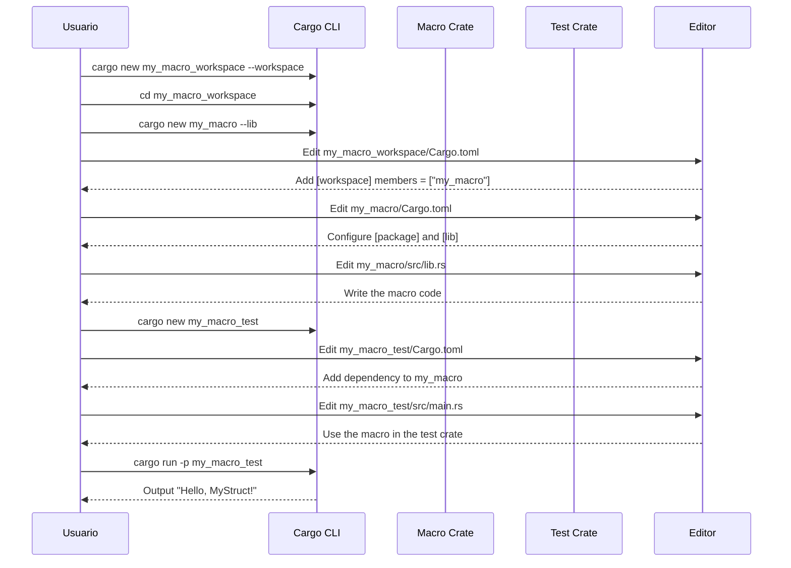

### Paso a Paso

#### Paso 1: Crear un Nuevo Workspace de Cargo

```sh
cargo new my_macro_workspace --workspace
cd my_macro_workspace
```

- **Comando**: `cargo new my_macro_workspace --workspace`
  - Crea un nuevo workspace de Cargo.
- **Comando**: `cd my_macro_workspace`
  - Navega al directorio del workspace.

#### Paso 2: Crear el Crate de la Macro

```sh
cargo new my_macro --lib
```

- **Comando**: `cargo new my_macro --lib`
  - Crea un nuevo crate de biblioteca llamado `my_macro` dentro del workspace.

#### Paso 3: Configurar el `Cargo.toml` del Workspace

Edita el archivo `Cargo.toml` en la raíz del workspace para incluir el nuevo crate:

```toml
# my_macro_workspace/Cargo.toml
[workspace]
members = ["my_macro"]
```

- **Configuración**: Incluye `my_macro` como miembro del workspace.

#### Paso 4: Configurar el Crate de la Macro

Edita el archivo `Cargo.toml` del crate `my_macro` para configurarlo como una macro procedural:

```toml
# my_macro/Cargo.toml
[package]
name = "my_macro"
version = "0.1.0"
edition = "2018"

[lib]
proc-macro = true

[dependencies]
syn = "1.0"
quote = "1.0"
```

- **`proc-macro`**: Indica que este crate es una macro procedural.
- **Dependencias**: Añade `syn` para el análisis sintáctico y `quote` para la generación de código.

#### Paso 5: Escribir la Macro Procedural

Edita el archivo `src/lib.rs` en el crate `my_macro` para implementar la macro:

```rust
extern crate proc_macro;

use proc_macro::TokenStream;
use quote::quote;
use syn::{parse_macro_input, DeriveInput};

#[proc_macro_derive(MyMacro)]
pub fn my_macro_derive(input: TokenStream) -> TokenStream {
    // Parse the input tokens into a syntax tree
    let input = parse_macro_input!(input as DeriveInput);

    // Build the output, possibly using quasi-quotation
    let name = &input.ident;
    let gen = quote! {
        impl #name {
            pub fn hello() -> String {
                format!("Hello, {}!", stringify!(#name))
            }
        }
    };

    // Hand the output tokens back to the compiler
    gen.into()
}
```

- **Importaciones**:
  - `proc_macro`: Biblioteca para crear macros procedurales.
  - `quote`: Biblioteca para generar código Rust.
  - `syn`: Biblioteca para analizar el código Rust.
- **Macro Attribute**: `#[proc_macro_derive(MyMacro)]`
  - Define una macro derivada llamada `MyMacro`.
- **Función `my_macro_derive`**:
  - **Entrada**: `TokenStream` de la macro.
  - **Análisis**: Convierte el `TokenStream` en un `DeriveInput` usando `syn`.
  - **Generación de Código**: Utiliza `quote` para generar una implementación de un método `hello` para la estructura anotada.
  - **Salida**: Devuelve el nuevo `TokenStream` al compilador.

#### Paso 6: Crear un Crate para Probar la Macro

```sh
cargo new my_macro_test
```

- **Comando**: `cargo new my_macro_test`
  - Crea un nuevo crate de binario llamado `my_macro_test` para probar la macro.

#### Paso 7: Configurar el Crate de Prueba

Edita el archivo `Cargo.toml` del crate `my_macro_test` para añadir una dependencia local a la macro:

```toml
# my_macro_test/Cargo.toml
[package]
name = "my_macro_test"
version = "0.1.0"
edition = "2018"

[dependencies]
my_macro = { path = "../my_macro" }
```

- **Dependencia Local**: Añade una dependencia local al crate `my_macro`.

#### Paso 8: Usar la Macro Procedural en el Crate de Prueba

Edita el archivo `src/main.rs` en el crate `my_macro_test` para usar la macro:

```rust
use my_macro::MyMacro;

#[derive(MyMacro)]
struct MyStruct;

fn main() {
    println!("{}", MyStruct::hello());
}
```

- **Uso de la Macro**: Aplica `#[derive(MyMacro)]` a `MyStruct`.
- **Generación de Código**: La macro genera un método `hello` para `MyStruct`.
- **Salida**: El método `hello` imprime "Hello, MyStruct!".

#### Paso 9: Compilar y Ejecutar el Crate de Prueba

```sh
cargo run -p my_macro_test
```

- **Comando**: `cargo run -p my_macro_test`
  - Compila y ejecuta el crate `my_macro_test`.

### Qué Hace el Código de la Macro

1. **Parsear la Entrada**:
   - La macro toma el `TokenStream` de la estructura anotada y lo convierte en un `DeriveInput` que `syn` puede manipular.

2. **Generar el Código**:
   - Utilizando `quote`, la macro genera un bloque `impl` para la estructura anotada.
   - Dentro del bloque `impl`, se define un método `hello` que devuelve una cadena con el formato "Hello, {nombre de la estructura}!".

3. **Devolver el Código Generado**:
   - La macro convierte el código generado nuevamente en un `TokenStream` y lo devuelve al compilador.

### Diagrama de Secuencia

Aquí está el diagrama de secuencia representado en Mermaid:



Este diagrama y la explicación detallada deberían darte una comprensión clara de cómo crear y utilizar una macro procedural en Rust.